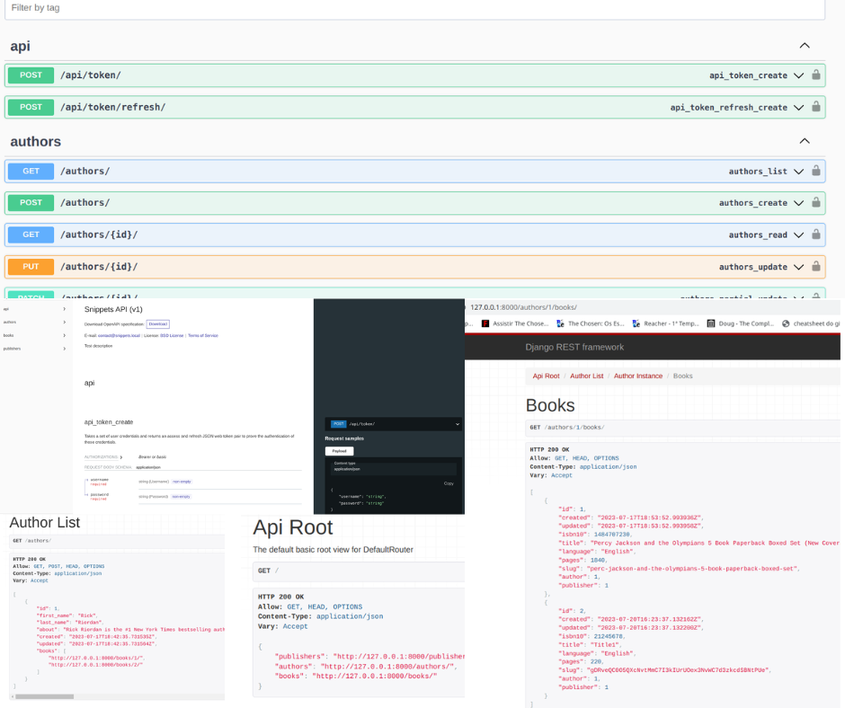

# <p align="center">REST API using [DRF]</p>

[DRF]: https://www.django-rest-framework.org/

[django]: https://docs.djangoproject.com/en/4.2/

[python]: https://docs.python.org/3/

[CRUD]: https://www.codecademy.com/article/what-is-crud

[swagger]:https://swagger.io/

[redoc]: https://swagger.io/blog/api-development/redoc-openapi-powered-documentation/

[my_github]: https://github.com/Kalebe614

#### <p align="center">Description
This project is a simple API developed with Django using the Django Rest Framework ([DRF]). Inspired by the concept of a basic library, the project offers three options for registration: book, publisher (publicadora), and author.

The main objective is to provide basic [CRUD] (Create, Read, Update, Delete) functionalities for books, authors, and publishers. Additionally, the project includes the option for browser-based queries and a complete [CRUD] with token-based authentication. Users can make API requests using tools like Insomnia or access the interactive documentation using [Swagger] and [Redoc].

Key features of the project:

[CRUD] for Book, Author, and Publisher.
Query all books by a specific author ID.
Query all books by a specific publisher ID.
Generate authentication token.
Interactive documentation using [Swagger] and [Redoc].
This project was created as a foundation for learning and showcasing the use of Django Rest Framework for building RESTful APIs. Feel free to explore the functionalities and use the API according to your needs.</p>





## Contents

- [Technologies Used](#technologies-used)

- [Installation](#installation)

- [Credits](#credits)

- [Contact](#contact)

## Technologies Used

- [Python][python]
- [Django][django]
- [DRF][DRF]

## Installation

<p>1. Clone the repository:

```
https://github.com/Kalebe614/drf-library-api.git
```

</p>

<p>
2. Navigate to the project directory:

```
cd drf_library_api
```
</p> 
 
<p>
3. Install the dependencies:

```
pip install -r requirements.txt
```
</p>
<p>
4. Run the database migrations:

```
python manage.py migrate
```
</p>
<p>
5. Create a new superuser

```
python manage.py createsuperuser
```
</p>
<p>
6. Execute the project:

```
python manage.py runserver
```
</p>
<p>
Now you can open: http://localhost:8000 or http://127.0.0.1:8000 to view it in the browser.
</p>

## Credits
CRUD app was built by [Kalebe de Oliveira][my_github]

## Contact
- Email: <a ref="mailto:kalebe613@gmail.com">kalebe613@gmail.com</a>
- [GitHub](https://github.com/Kalebe614)

